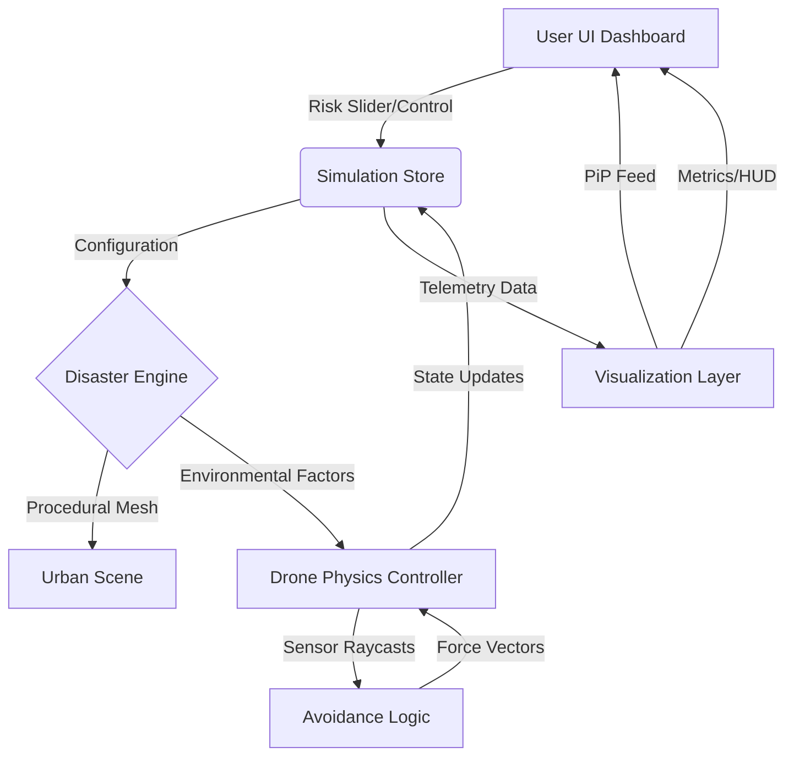

# AETHER: Adaptive Synthetic Disaster Training Engine

AETHER is a high-fidelity disaster response simulator designed for autonomous drone navigation training in complex 3D environments. It provides a procedural generation engine that creates dynamic urban disaster scenarios, coupled with an AI-driven navigation system capable of 3D obstacle avoidance and survivor search.

## System Architecture

The simulation is built on a decoupled, event-driven architecture that separates the physical simulation from the control logic and telemetry visualization.

### Core Components

1.  **Procedural Environment Generator (PEG)**:
    - Runtime mesh fracture system for generating realistic urban debris.
    - Multi-scenario disaster layers (Flood water plane, Fire/Smog volumetric approximations).
    - Randomized target (Survivor) placement algorithms ensuring unique search paths per iteration.

2.  **Anti-Gravity Rigidbody Controller**:
    - Custom physics implementation utilizing constant upward force (Hover) and multi-axis AddForce vectors.
    - Risk-based behavior reweighting using Mathf.Lerp to interpolate between Safe and Rush modes.

3.  **Autonomous Navigation Unit (ANU)**:
    - 3D Vertical Awareness: Sensor raycasting on X, Y, and Z axes for complex avoidance.
    - PPO-compliant observation space processing (distance, heading, obstacle proximity).
    - Goal-seeking force vectors that dynamically adjust based on real-time collision risks.

4.  **Telemetry and Visualization Overlay**:
    - Real-time Picture-in-Picture (PiP) drone-mounted POV camera.
    - HUD metrics (Inference latency, CPU load, Power consumption, Reward functions).
    - Trail-rendering for historical path analysis.

### System Diagram

## Technical Specification

- **Core Engine**: React Three Fiber / Three.js
- **Physics**: Cannon.js integration (Rigidbody physics)
- **Navigation Logic**: 3D Vector Calculus for goal seeking and avoidance
- **UI Framework**: Next.js with Tailwind CSS
- **State Management**: Zustand-based centralized store
- **Edge Deployment Target**: ONNX Runtime / AMD Ryzen AI NPU optimization

## Navigation Modes

### 3D Vertical Avoidance
Unlike standard 2D simulators, AETHER drones can detect obstacles above and below them. The avoidance logic calculates a repulsion vector from obstacles and combines it with an aspiration vector towards the survivor, allowing the drone to navigate through narrow vertical passages.

### Risk Dynamic Scaling
The Risk Slider (0-100%) reweights the AI's internal reward structure in real-time:
- **Low Risk**: Prioritizes higher clearance from obstacles and smoother deceleration.
- **High Risk**: Minimizes safety margins and increases propulsion force to reach target faster.

## Disaster Scenarios

- **Flood Mode**: Dynamic water plane rising and floating debris implementation.
- **Fire Mode**: Particle-inspired smog planes and visibility reduction to test sensor-only navigation.
- **Structural Collapse**: Procedurally fractured building geometry with unstable geometry physics.
